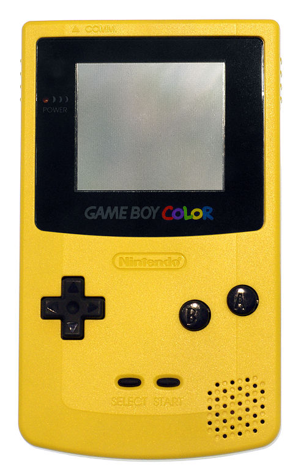

Proyecto 2 - Replica Videoconsola (HtML5,CSS3,Javascipt)

    

#  Contenido:
 

- ### [Descripción del proyecto 📋](#Descripción-del-proyecto)
- ### [Acerca de 🎮](#Acerca)
- ### [Desarrollo 🖥️](#Desarrollo)
- ### [Estado del proyecto 🚧](#Estado)
- ### [Repositorio GitHub 💾](#Repositorio)
- ### [Licencia y Copyright 📜](#Licencia)

    

### Descripción del proyecto 
 

##### Este proyecto esta basado en una réplica de la videoconsola GameBoy Color utilizando Visual Studio Code.

    

### Acerca de 

 
